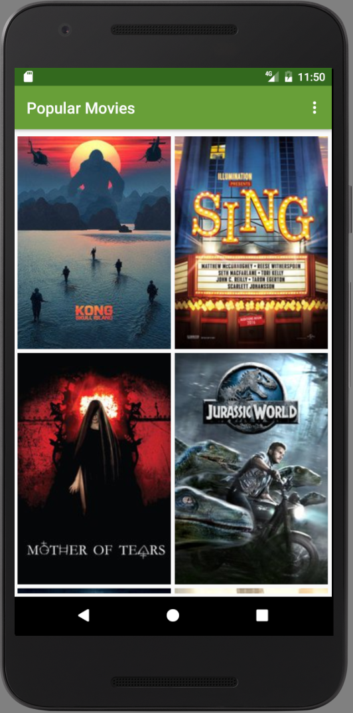
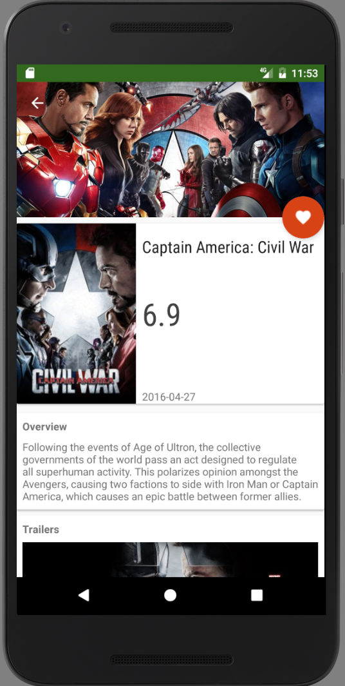

Popular Movies App
====================
Project for Udacity course Developing Android Apps
An android app that allows users to discover the most popular movies playing

**Features:**
- Discover the most popular movies, sorted by most popular, or by top rated.
- Check out movies' plot synopsis and users rating.
- View and play trailers with youtube app.
- Read reviews of a selected movie.
- Mark a movie as a favorite and save it as local movie collection

How to work with the source:
You need to request your own API Key in order to work with themoviedb.org API

Screenshots:
------------

